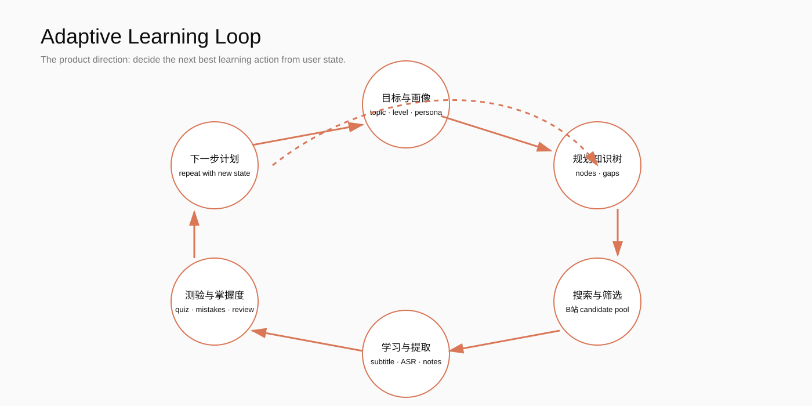

# BiliLearn 3.1.6 项目全景说明

> AI 驱动的本地 B 站学习与互动工作台 · 状态截至 2026-09-13

## 摘要

BiliLearn 的核心不是“把视频总结成文章”，而是围绕用户目标建立持续学习闭环：目标、知识树、搜索、学习、知识提取、测验、掌握度和下一步计划。3.1.6 是可用性与稳定性版本，重点完成了账户安全、兴趣持久化、首次引导、模型配置和学习闭环基础设施。

## 完成度总览

| 领域 | 状态 | 说明 |
|---|---|---|
| Web 面板与鉴权 | 已完成 | 默认仪表盘、yaya/yaya 初始化、网页登录、退出、恢复密码 |
| B 站认证 | 已完成 | QR 登录与 Cookie 导入/校验；密码不落盘 |
| 兴趣偏好 | 已完成 | 手动内容受保护；AI 添加仅在开关和概率命中时触发 |
| AI/人格/Agent | 已完成基础版 | 多人格、上下文人格、Agent 工具、MCP 配置 |
| 学习闭环 | 已完成基础版 | 多主题、知识树、候选视频、学习记录、测验、复习计划 |
| 模型配置 | 已完成 | 完整拉取模型列表、原生下拉框、可选模型测试、操作互斥 |
| 安全与审核 | 已完成 | 智能安全默认开启、审核失败重试、免责声明倒计时 |
| ASR/深研/导出 | 可用 | 依赖本地环境和已配置服务，部分能力按需启用 |
| 自动自适应 Agent 闭环 | 规划中 | 需要进一步把检索、评估、复习编排成长期后台任务 |

## 整体架构

入口层是 Flask Web Panel；服务层由学习闭环、Agent、人格、兴趣、安全审核、ASR、深研和导出服务组成；数据层默认位于 `%LOCALAPPDATA%/BiliLearn`，知识、配置、日志和导出物分开存储。外部连接只在用户配置并触发时发生。

## 已交付能力

- 首次使用先选择“学习+陪伴 / 纯学习 / 纯陪伴”，随后可在设置中切换。
- 学习主题支持多个，每个主题拥有独立目标、知识节点、候选视频和掌握度。
- 兴趣关键词的人工内容不会被 AI 覆盖、删除或替换；AI 建议默认关闭并受概率控制。
- 模型列表返回完整提供商结果，不再固定截断 200 条；获取列表和可用性测试互斥。
- 配置编辑分区始终可见；ASR 有总开关；退出登录使用网页内弹层。
- 项目介绍、README、版本元数据统一为 3.1.6；日志查看器过滤旧免费渠道启动噪声。

## 学习闭环

当前可执行流程：创建主题 → 建立知识树 → 分析知识缺口 → 搜索 B 站候选 → 打开视频并标记完成 → 记录测验 → 更新掌握度和复习任务。后续将把视频字幕/ASR、知识实体、错题和间隔复习进一步自动化。

## 质量与验证

- `pytest -q`：444 passed，1 个 Windows asyncio 环境警告。
- 内联 JavaScript 解析通过。
- 浏览器实测：免责声明、登录、默认仪表盘、学习闭环、多主题选择、配置模型下拉、无控制台错误。
- 测试 API Key 未写入源码、文档、配置或日志。

## 后续路线

### P1：把基础闭环做深

字幕/ASR 自动入库、知识实体与关系、测验题库、错题驱动搜索、间隔复习和今日任务。

### P2：Agent 编排

将 Planner、Researcher、Learner、Evaluator、Reviewer 拆分为可观测任务；增加取消、重试、预算、权限和人工插话。

### P3：产品体验

完善各分区教程与空状态、移动端学习终端、可视化知识图谱、导出模板和无障碍/减少动画支持。

### P4：长期能力

语义去重、个性化推荐评估、复习遗忘曲线、游戏化激励，以及 Android 端“首页/学习/知识库/AI”四栏体验。

## 使用边界

BiliLearn 是本地学习与自动化实验工具。B 站账号操作、内容版权、平台规则和 AI 输出风险由使用者自行承担。建议默认开启安全审核、先使用模拟模式，并为数据目录建立定期备份。

## 版本信息

当前版本：**3.1.6**。历史版本：3.1.5 为功能基础整合版本；3.1.6 为稳定性、数据安全和学习闭环可用性版本。
